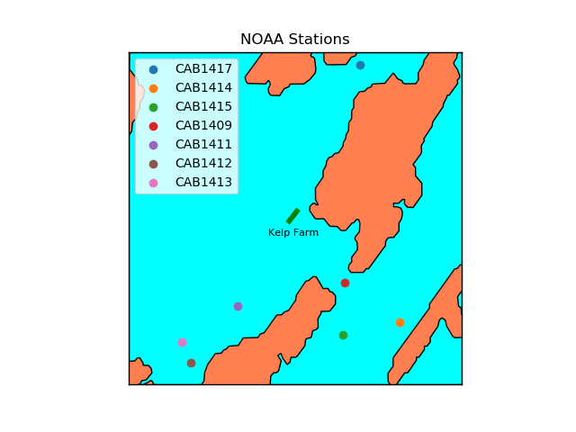

# BigelowResearch
> Modelling the effect of Kelp on Ocean Chemistry and Mussel Growth

This is the research I did for Bigelow Laboratory for Ocean Sciences, working closely with Professor Bruce Maxwell and Dr. Nichole Price.

### Summary

Rising atmospheric CO2 has caused increased levels of CO2 in seawater, which can damage the strength of shellfish shells during the growth phrase. It has been hypothesized that by planting kelp in the vicinity of the shellfish, photosynthetic activity will create a halo of lower CO2 levels around the kelp farm, which can help the mussels grow at a faster pace. My job is to model the data collected from boating trips to evaluate the change.

### The Data

Data was collected from Bigelow labs from several boating trips around the kelp farm over a course of two years. There were many features that were collected, but we chose to focus on the following features:

| Variable Name   | Role          | Type        | Units   |
|:---------------:|:-------------:|:-----------:|:-------:|
| pCO2 / fCO2     | Response      | Numerical   |µatm     |
| O2              | Explanatory   | Numerical   |µmol / L |
| Salinity        | Explanatory   | Numerical   |Practical Salinity Unit (PSU)        |
| Water Temp      | Explanatory   | Numerical   |Cº       |
| Chlorophyll a   | Explanatory   | Numerical   |mg/m3    |
| Omega Aragonite | Explanatory   | Numerical   |unitless |

### Example Visualizations

       
      
            

Animations to display change of CO2 over time and more visualizations can be found in the <b>visualization</b> folder.

### Procedure

#### Preliminary Analysis

For some preliminary analysis, we created a kernel density plot (kde) and box and whisker to show the distribution of pCO2 and fCO2 in each boating trip. The KDE shows off the relative density of each range of values, while the box and whisker shows off the five statistical benchmarks (min, 1st quadrant, median, 3rd quadrant, max). All the data used are taken from a 300m boundary to the kelp farm (so the bounding box is 300m north of the northmost point of the farm, etc). 

In these two plots, I am assuming pCO2 and fCO2 are the same.

       
       

We also noticed a significant increase in the number of data points available in Dec 2017, March 2018, and May 2018.

#### Linear Analysis

We also created plots that show the linear relationships between other independent variables, and CO2. All the data were collected in a 300m window as the farm, which is the same as the one described in Section II. CO2 levels that were either below 100 or above 600 were also trimmed. 

       
       
       

> Using pCO2, salinity, chlorophyll a, water temp, O2

       
       
       

> Using fCO2 and omega Aragonite

Note that the linear plots containing Omega Aragonite and fCO2 also has the distribution of the points in the top and right.

We see that the 5 independent variables have correlations with each other. I decided to investigate further by conducting a Principle Component Analysis (PCA) 

#### Dimension Reduction

I also performed a PCA analysis on the independent variables, pCO2, salinity, chlorophyll a, water temp, O2, and took the 3 most important eigenvectors, 
I then performed clustering analysis (n=4) in the pca space, and labelled the data points in latitude longitude space based on each cluster.

       
      
       

> 2017-03-17

 

       
      
       

 
> 2017-05-02
 

       
      
       

> 2017-12-19

Especially present in the May 2, 2017 plot, there is a strong cluter in the viscinity of the kelp farm, which leads me to believe that the kelp is actively changing the independent variables.

#### Interpolation

Our main method of interpolation is Bilateral Filtering. For every data point on the heatmap, bilateral filtering replaces the CO2 value with a weighted average of intensity values from nearby values in the dataset. The closer a data point is to the interpolated point, the more weight it gets. In each photo, there are 12 frames, and each frame represents a section of time on the boat trip. This allows us to view the interpolation as time progresses.

I also have included the current direction, as well as a relative magnitude scale. The current is interpolated from a nearby NOAA station (see VI)

There also exists a lag time from when the boat collects the data to when the data actually reaches the boat. The lag time is estimated to be between 1 and 5 minutes. For each date, the left column represents the interpolated values using the original data, and the right represents the interpolated values using the corrected latitude and longitude. For the corrected values, the lag time is set to 200 seconds.

       
      
       
       
       

#### Addendum

Tidal and Current data are collected from the CAB1409 buoy

       

### Results and Analysis

These visualizations have helped biologists and ecologists at Bigelow Laboratory understand the effect of a kelp farm in the vicinity of a mussels. My heatmaps have spotted an interesting anomaly: in some months, such as March 2018, the kelp seemed to have a negative effect on the surrounding. However, in other months, such as May 2017, the kelp seems to lower surrounding CO2 levels. Therefore, a definitive conclusion cannot be established at this time, but it is clear that the kelp has an effect in its surroundings.

### Tools and Packages

I made my plots and visualizations using Matplotlib and Seaborn in Python. Data cleaning and processing was done using Pandas and Numpy in Python.
